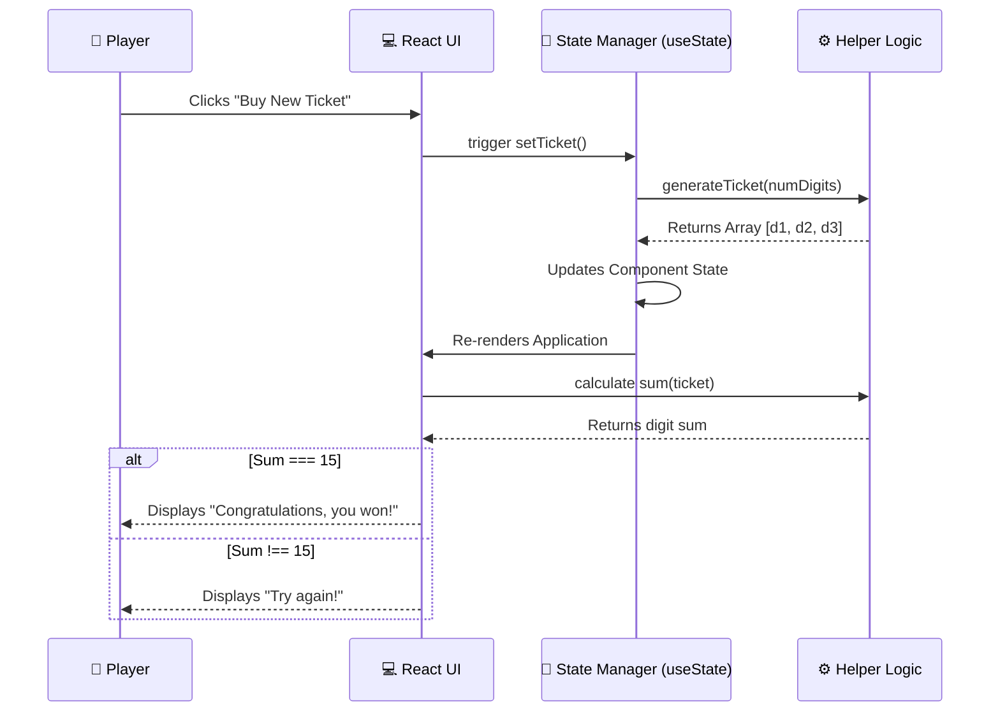

<div align="center">

# 🎟️ React Lottery Game

### A sleek interactive lottery simulator built with React to demonstrate state management and dynamic logic.

[](https://react.dev/)
[](https://vitejs.dev/)
[](https://developer.mozilla.org/en-US/docs/Web/JavaScript)
[](https://developer.mozilla.org/en-US/docs/Web/CSS)

[🌐 Play Live](#) <!-- Update with actual deployment link if available -->

</div>

---

## 📌 About

This project is a lightweight, frontend-only **Lottery Game** built to explore and demonstrate core React concepts. It focuses on functional components, state handling (via `useState`), array manipulation, and random mathematical logic generation. 

The core premise of the game is simple: A random ticket is generated, and if the sum of all digits on the ticket equals exactly `15`, you win! 

*(Example: `357` → 3 + 5 + 7 = 15 🏆)*

---

## ✨ Features

- **Dynamic Ticket Generation** — Generates a randomized N-digit lottery ticket on demand.
- **Instant Win Condition Calculation** — Automatically computes the sum of the digits and evaluates it against the winning target (`15`).
- **Real-Time State Updates** — Utilizes React's `useState` for instantaneous UI re-rendering upon ticket generation.
- **Component Reusability** — Clean separation of logic, allowing for scalable UI components.
- **Responsive Styling** — Clean and simple CSS interface.

---

## 🏗️ System Architecture

```mermaid
graph TB
    subgraph UI["💻 User Interface"]
        APP["App Component<br/><i>Main Container</i>"]
        TKT["Ticket Component<br/><i>Displays Digits</i>"]
        BTN["Button Component<br/><i>Triggers Action</i>"]
    end

    subgraph Logic["⚙️ Game Logic"]
        STATE["React State<br/><i>useState Hook</i>"]
        MATH["Helper Functions<br/><i>sum(), generateTicket()</i>"]
    end

    APP -->|"Passes State (props)"| TKT
    APP -->|"Passes Action (props)"| BTN
    BTN -->|"onClick Event"| STATE
    STATE -->|"Calls"| MATH
    MATH -->>|"Returns new ticket array"| STATE
    STATE -->>|"Triggers Re-render"| APP
```

---

## 🔄 Interaction Flow



---

## 🛠️ Tech Stack

| Layer | Technology | Purpose |
|:---:|:---|:---|
| **Frontend Framework** | React 19 | Component-based UI rendering |
| **Build Tool** | Vite | Lightning fast HMR and optimized bundling |
| **Language** | JavaScript (ES6+) | Core game logic and calculations |
| **Styling** | Vanilla CSS | Styling and layout structure |

---

## 📂 Project Structure

```text
Lottery-Game/
├── public/              # Public assets (Favicon, etc.)
├── src/                 # Main source code
│   ├── assets/          # Static assets (images, svg)
│   ├── components/      # (If split) Ticket, Button modules
│   ├── helper.js        # Mathematical helper functions (sum, generate)
│   ├── App.jsx          # Main root component & state container
│   ├── main.jsx         # React DOM entry point
│   └── App.css          # Application styles
├── index.html           # HTML template
├── vite.config.js       # Vite configuration
└── package.json         # Node dependencies & scripts
```

---

## 🚀 Getting Started

### Prerequisites
- Node.js (v16 or higher)

### 1. Clone the repository

```bash
git clone https://github.com/iZiaur/Lottery-Game.git
cd Lottery-Game
```

### 2. Install Dependencies

```bash
npm install
```

### 3. Start Development Server

```bash
npm run dev
```
> The application will run locally at `http://localhost:5173`. Open your browser to play!

### 4. Build for Production

```bash
npm run build
npm run preview
```

---

## 📄 License

This project is open source and available under the [MIT License](LICENSE).

---

<div align="center">

**Built with ❤️ by [Ziaur Rahman](https://github.com/iZiaur)**

</div>
